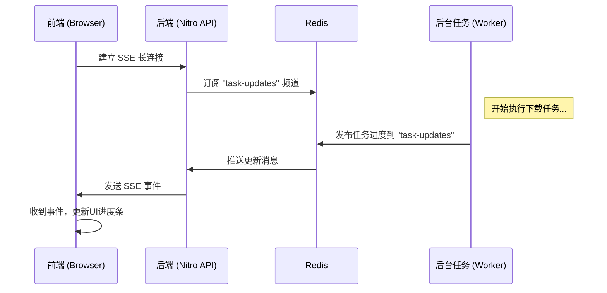
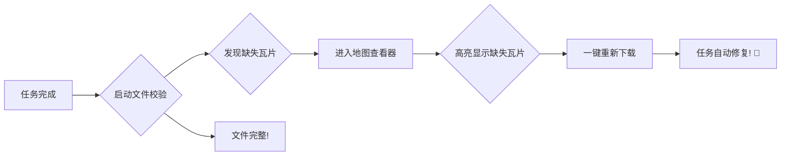

---
# 全局配置
theme: seriph
title: 'GeoScraper: 我把地图下载做成了一个开源项目！'
titleTemplate: '%s - GeoScraper'
info: |
  一个为开发者打造的地理瓦片下载与管理平台。
  Bilibili 技术分享。
author: '爱吃包子的超'
lineNumbers: true # 代码块显示行号
drawings:
  persist: false
fonts:
  # 使用免费开源的字体，对中文更友好
  sans: 'Noto Sans SC'
  serif: 'Noto Serif SC'
  mono: 'Fira Code'
---

# GeoScraper: 我把地图下载做成了一个开源项目！

<div class="pt-12">
  <span class="px-2 py-1 rounded bg-blue-50 text-blue-500">一个为开发者打造的地理瓦片下载与管理平台</span>
</div>

<div class="abs-br m-6 flex gap-2">
  <a href="https://github.com/lanseria/geoscraper" target="_blank" alt="GitHub"
    class="text-xl slidev-icon-btn opacity-50 !border-none !hover:text-white">
    <carbon-logo-github />
  </a>
</div>

<!-- 
大家好，欢迎来到我的频道！
今天我要给大家分享一个我最近做的开源项目——GeoScraper。
这是一个能帮你轻松下载和管理地理瓦片地图的 Web 工具。
-->

---
layout: center
class: text-center
---

# 你的项目，是否需要“离线地图”？

<div class="grid grid-cols-2 gap-4 text-left p-8">
<div class="p-4 bg-gray-100 dark:bg-gray-800 rounded-lg">
<h3 class="font-bold text-lg">应用场景</h3>
<ul class="list-disc pl-6">
  <li>GIS 数据分析与可视化</li>
  <li>内网环境下的地图应用</li>
  <li>野外勘探、应急救援等无网络场景</li>
  <li>游戏开发中的地图素材</li>
</ul>
</div>
<div class="p-4 bg-gray-100 dark:bg-gray-800 rounded-lg">
<h3 class="font-bold text-lg">你可能遇到的“痛”</h3>
<ul class="list-disc pl-6">
  <li>在线地图服务昂贵或有访问限制</li>
  <li>手动下载？计算复杂、易中断、易出错</li>
  <li>下载了上万张瓦片，怎么知道有没有漏？</li>
  <li>如何管理和预览这些海量小文件？</li>
</ul>
</div>
</div>

<!-- 
在很多场景下，我们都需要能离线访问的地图数据。
但获取这些数据往往伴随着各种各样的问题。
为了解决这些痛点，我开发了 GeoScraper。
-->

---
layout: center
---

# ✨ GeoScraper 登场！

一个 **开源、可视化** 的地理瓦片下载与管理工具

<div class="m-8">
把复杂的下载过程，变成几次简单的点击。
</div>

<div class="flex justify-center items-center gap-4 text-4xl">
<logos-nuxt-icon />
<logos-vue />
<logos-postgresql />
<logos-redis />
<logos-docker-icon />
</div>
<div class="text-sm mt-2 text-gray-500">
基于 Nuxt 3 / Drizzle ORM / PostgreSQL / Redis / Docker 等现代技术构建
</div>


---

# 核心功能一览

<div class="grid grid-cols-2 gap-8">

<div>
<h3 class="font-bold text-xl mb-2">📊 任务仪表盘</h3>

<ul class="text-sm list-disc pl-5 mt-2">
  <li>所有任务状态一目了然</li>
  <li>实时进度更新 (稍后揭秘)</li>
  <li class="opacity-70">一键启动、重试、删除</li>
</ul>
</div>

<div>
<h3 class="font-bold text-xl mb-2">🗺️ 可视化创建任务</h3>

<ul class="text-sm list-disc pl-5 mt-2">
  <li>在地图上直接框选范围</li>
  <li>支持多级别缩放同时下载</li>
  <li class="opacity-70">并发数、延迟等高级配置</li>
</ul>
</div>

</div>

<!--
这里我放了两张项目的截图。
左边是主仪表盘，右边是创建任务的界面。
可以看到，整个操作流程非常直观。
-->

---

# 魔法揭秘：如何实现“实时”更新？

答案是：**Server-Sent Events (SSE) + Redis**

<div class="grid grid-cols-2 gap-8 items-center">
<div>
后端任何任务状态的变更（如进度更新），都会通过 Redis 的发布/订阅（Pub/Sub）模式，推送给所有连接的客户端。
<br><br>
<span class="text-gray-500 text-sm">优势：轻量、原生、无需复杂的 WebSocket。</span>
</div>

<div>


</div>
</div>

<!-- 
这是项目的一个技术亮点。
我没有用传统的轮询，而是使用了 SSE 技术。
这个流程图清晰地展示了数据是如何从后台任务实时地流向前端界面的。
-->

---
layout: two-cols
---

# 项目技术架构

一套基于 Nuxt 3 的全栈解决方案。

::left::

### 🚀 前端 (Frontend)
- **框架**: Nuxt 3 / Vue 3
- **状态管理**: Pinia
- **UI & 样式**: UnoCSS
- **地图**: MapLibre GL
- **核心**: 响应式、组件化

::right::

### ⚙️ 后端 (Backend)
- **服务端**: Nitro (Nuxt 内核)
- **数据库**: PostgreSQL
- **ORM**: Drizzle ORM (类型安全!)
- **异步与实时**: Redis
- **核心**: API 路由、后台任务

<br>
<div class="p-3 bg-teal-50 dark:bg-teal-900/50 rounded-lg text-teal-800 dark:text-teal-300">
<carbon-light class="inline-block" /> **亮点**: 全栈同构，从数据库到前端组件，全程 TypeScript 类型安全！
</div>

---
layout: center
---

# 代码亮点：`downloader.ts`

来看看瓦片下载器的核心逻辑。

```ts {3,6|10-12|19-21}
// server/utils/downloader.ts

// 使用 mapType 替代 taskId，实现缓存共享
const saveDir = path.join(storageRoot, mapType, String(z), String(x))
const filePath = path.join(saveDir, `${y}.png`)

// 下载前先检查文件是否已存在且有效
try {
  const fileStats = await stat(filePath)
  if (fileStats.size > 0)
    return 'skipped_exists' // 文件有效，跳过
}
catch (error: any) {
  if (error.code !== 'ENOENT') // 忽略“文件未找到”的错误
    return 'failed'
}

// ofetch 配置，支持代理和自动重试
const fetchOptions: any = {
  retry: 3, // 自动重试3次
  retryStatusCodes: [408, 429, 500, 502, 503, 504],
  ...(config.proxyUrl && { // 支持HTTP代理
    dispatcher: new ProxyAgent(config.proxyUrl),
  }),
}
```

<!-- 
我没有贴全部代码，而是选择了几个我认为设计得比较好的点。
1. 共享缓存：不同任务只要地图类型相同，就可以复用瓦片，节省空间。
2. 健壮性：下载前会检查文件，并且有重试机制。
3. 灵活性：支持配置代理，应对复杂的网络环境。
-->

---

# 下载完了就结束了？还没！

GeoScraper 提供了一套完整的 **校验 -> 修复** 闭环工作流。



<div class="text-sm mt-4 text-gray-500">
这解决了海量小文件下载后，最头疼的“完整性”问题。
</div>


---

# 地图查看器：眼见为实

内置的查看器，不仅能预览，还能做更多。

<div class="grid grid-cols-2 gap-8 items-center">

<div>

</div>

<div class="space-y-4">
  <div class="flex items-start gap-2">
    <carbon-map class="text-2xl text-sky-500 mt-1" />
    <div>
      <h4 class="font-bold">本地瓦片预览</h4>
      <p class="text-sm opacity-80">直接查看你下载的离线地图效果。</p>
    </div>
  </div>
  <div class="flex items-start gap-2">
    <carbon-checkbox-checked-filled class="text-2xl text-red-500 mt-1" />
    <div>
      <h4 class="font-bold">缺失瓦片高亮</h4>
      <p class="text-sm opacity-80">校验后，所有缺失的瓦片都会在地图上被红色高亮。</p>
    </div>
  </div>
  <div class="flex items-start gap-2">
    <carbon-select-window class="text-2xl text-orange-500 mt-1" />
    <div>
      <h4 class="font-bold">标记空白区域</h4>
      <p class="text-sm opacity-80">对于海洋等空白瓦片，可以手动标记为“不存在”，避免被误判为缺失。</p>
    </div>
  </div>
</div>
</div>


---
layout: two-cols-header
---

# 部署？Docker 帮你搞定！

项目提供了优化的 `Dockerfile`，采用**多阶段构建**。

::left::

```dockerfile
# ---- Stage 1: Build ----
FROM node:22 AS build-stage
WORKDIR /app
COPY .npmrc package.json ... ./
RUN pnpm install --frozen-lockfile
COPY . .
RUN pnpm build

# ---- Stage 2: Production ----
FROM node:22-slim AS production-stage
WORKDIR /app
# 只复制编译好的产物
COPY --from=build-stage /app/.output ./.output
EXPOSE 3000
CMD ["node", ".output/server/index.mjs"]
```

::right::

<div class="ml-4 space-y-4">

<div class="p-3 border rounded-lg">
<h4 class="font-bold">✅ 最终镜像小</h4>
<p class="text-sm opacity-80">不包含源代码、开发依赖，体积大幅减小。</p>
</div>

<div class="p-3 border rounded-lg">
<h4 class="font-bold">🔒 更安全、纯净</h4>
<p class="text-sm opacity-80">生产环境只包含必要的运行文件。</p>
</div>

<div class="p-3 border rounded-lg">
<h4 class="font-bold">🚀 轻松部署</h4>
<p class="text-sm opacity-80">一行 `docker build` & `docker run` 即可启动。</p>
</div>

</div>


---
layout: center
---

# 立即体验！

这个项目已经开源在 GitHub 上，欢迎大家 Star 和贡献！

<div class="text-2xl my-6">
<a href="https://github.com/lanseria/geoscraper" target="_blank" class="border-b-2">
github.com/lanseria/geoscraper
</a>
</div>

<div class="grid grid-cols-2 gap-4 text-left">
<div>
<h3 class="font-bold">💡 项目亮点总结</h3>
<ul class="list-disc pl-5">
  <li>开源免费</li>
  <li>功能完整，覆盖下载到校验修复</li>
  <li>现代全栈技术栈 (Nuxt 3)</li>
  <li>易于部署和二次开发</li>
</ul>
</div>
<div>
<h3 class="font-bold">🚀 下一步计划</h3>
<ul class="list-disc pl-5">
  <li>支持更多地图源</li>
  <li>任务导出与导入</li>
  <li>使用 BullMQ 优化后台队列</li>
</ul>
</div>
</div>

---
layout: center
class: text-center
background: https://cover.sli.dev/
---

# 感谢观看！

如果觉得这个项目对你有帮助，或者你喜欢这个分享

<div class="text-6xl mt-8 animate-bounce">
👍🪙⭐
</div>

<div class="text-2xl mt-4">
别忘了给视频和 GitHub 项目 **一键三连** 哦！
</div>

<br>
<p>Created by **爱吃包子的超** with **Slidev**</p>
<!-- 
最后，再次感谢大家的观看，我们下个视频再见！
-->
