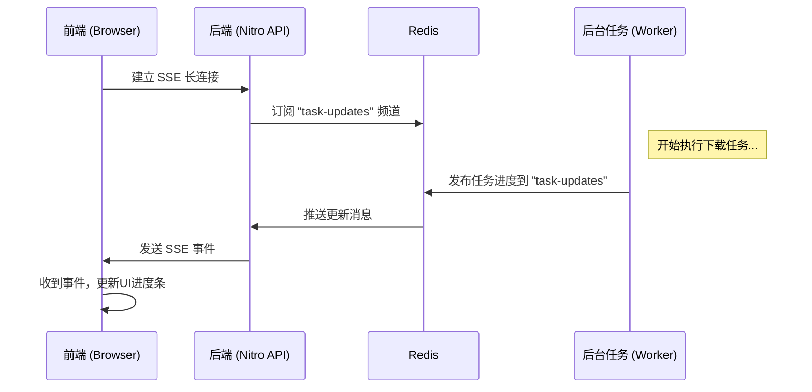
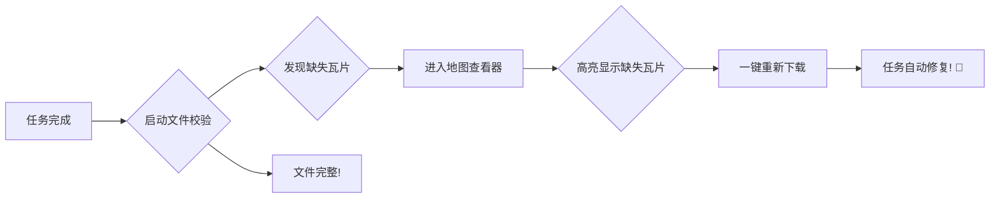

---
# 全局配置
theme: seriph
title: 'GeoScraper: 我把地图下载做成了一个开源项目！'
titleTemplate: '%s - GeoScraper'
info: |
  一个为开发者打造的地理瓦片下载与管理平台。
  Bilibili 技术分享。
author: '爱吃包子的超'
lineNumbers: true # 代码块显示行号
drawings:
  persist: false
fonts:
  # 使用免费开源的字体，对中文更友好
  sans: 'Noto Sans SC'
  serif: 'Noto Serif SC'
  mono: 'Fira Code'
---

<div class="text-center">
  <h1 class="text-6xl font-bold">想用离线谷歌地图？</h1>
  <h2 class="text-4xl mt-4">我做了个开源项目：GeoScraper</h2>
</div>

<div class="pt-12 text-center">
  <span class="px-2 py-1 rounded bg-blue-50 text-blue-500">一个为开发者打造的地理瓦片下载与管理平台</span>
</div>

<div class="abs-b left-0 right-0 p-4 text-center text-xs text-gray-400">
  <carbon:warning-alt class="inline-block"/>
  <span class="ml-1">本项目仅供学习交流，请勿用于商业用途，数据版权归原服务商所有，使用后果自负。</span>
</div>

<div class="abs-br m-6 flex gap-2">
  <a href="https://github.com/lanseria/geoscraper" target="_blank" alt="GitHub"
    class="text-xl slidev-icon-btn opacity-50 !border-none !hover:text-white">
    <carbon-logo-github />
  </a>
</div>

<!--
大家好，欢迎来到我的频道！我是爱吃包子的超。
今天我想问大家一个问题：你在做项目的时候，有没有想过要用离线地图，特别是像谷歌卫星图这样的高清地图？
为了解决这个问题，我利用业余时间开发了一个开源项目——GeoScraper。
它是一个能帮你轻松下载和管理地理瓦片地图的Web工具。
在开始之前，我要特别声明一下，这个项目目前仅供学习和技术交流，请大家不要用于商业用途，数据的版权归属于原始的服务提供商，任何使用后果都需要自己承担哦。
好，让我们开始吧！
-->

---
layout: center
class: text-center
---

# 你的项目，是否需要“离线地图”？

<div class="grid grid-cols-2 gap-4 text-left p-8">
<div class="p-4 bg-gray-100 dark:bg-gray-800 rounded-lg">
<h3 class="font-bold text-lg">应用场景</h3>
<ul class="list-disc pl-6">
  <li>GIS 数据分析与可视化</li>
  <li>内网环境下的地图应用</li>
  <li>野外勘探、应急救援等无网络场景</li>
  <li>游戏开发中的地图素材</li>
</ul>
</div>
<div class="p-4 bg-gray-100 dark:bg-gray-800 rounded-lg">
<h3 class="font-bold text-lg">你可能遇到的“痛”</h3>
<ul class="list-disc pl-6">
  <li>在线地图服务昂贵或有访问限制</li>
  <li>手动下载？计算复杂、易中断、易出错</li>
  <li>下载了上万张瓦片，怎么知道有没有漏？</li>
  <li>如何管理和预览这些海量小文件？</li>
</ul>
</div>
</div>

<!--
我们先来聊聊，为什么我们需要离线地图呢？
不管你是在做GIS数据分析、内网部署，还是在为游戏或野外勘探做准备，离线地图都非常关键。
但要自己搞定离线地图，往往会遇到很多头疼的问题。比如在线服务太贵、手动下载太蠢、下了几万张小图片根本不知道有没有漏掉...
这些痛点，相信很多做过相关开发的朋友都深有体会。
-->


---
layout: center
---

# ✨ GeoScraper 登场！

一个 **开源、可视化** 的地理瓦片下载与管理工具

<div class="m-8">
把复杂的下载过程，变成几次简单的点击。
</div>

<div class="flex justify-center items-center gap-4 text-4xl">
<logos-nuxt-icon />
<logos-vue />
<logos-postgresql />
<logos-redis />
<logos-docker-icon />
</div>
<div class="text-sm mt-2 text-gray-500">
基于 Nuxt 3 / Drizzle ORM / PostgreSQL / Redis / Docker 等现代技术构建
</div>

<!--
所以，这就是我们今天的主角——GeoScraper！
它的核心目标，就是把前面那些复杂的、令人头疼的下载过程，变成几次简单的鼠标点击。
这个项目也是我实践全栈技术的一个练手作品，用到了Nuxt、Vue、PostgreSQL、Redis还有Docker这些比较流行的技术。
-->

---

# 核心功能一览

<div class="grid grid-cols-2 gap-8">

<div>
<h3 class="font-bold text-xl mb-2">📊 任务仪表盘</h3>

<ul class="text-sm list-disc pl-5 mt-2">
  <li>所有任务状态一目了然</li>
  <li>实时进度更新 (稍后揭秘)</li>
  <li class="opacity-70">一键启动、重试、删除</li>
</ul>
</div>

<div>
<h3 class="font-bold text-xl mb-2">🗺️ 可视化创建任务</h3>

<ul class="text-sm list-disc pl-5 mt-2">
  <li>在地图上直接框选范围</li>
  <li>支持多级别缩放同时下载</li>
  <li class="opacity-70">并发数、延迟等高级配置</li>
</ul>
</div>

</div>

<!--
话不多说，我们直接来看项目长什么样。
左边是项目的主界面——任务仪表盘。你可以看到所有任务的状态、进度，一目了然。
右边是创建任务的界面。你可以直接在地图上拖拽来选择范围，选择要下载的缩放级别，操作非常直观。
大家注意看左边这个进度条，它是实时更新的，背后的技术我们稍后揭秘。
-->

---
layout: center
class: text-center
---

# 下载地图，数据量有多“夸张”？

### 以 **舟山群岛** 为例，估算下载谷歌卫星图的数据量

<div class="grid grid-cols-1 md:grid-cols-4 gap-4 mt-8">
<div v-click class="p-4 border rounded-lg">
  <h4 class="font-bold text-lg">Zoom 16</h4>
  <p class="text-2xl font-mono mt-2">92,208</p>
  <p class="text-sm text-gray-500"><carbon-image-copy class="inline-block" /> 瓦片</p>
  <p class="text-2xl font-mono mt-2">2.64 GB</p>
  <p class="text-sm text-gray-500"><carbon-data-base class="inline-block" /> 磁盘占用</p>
</div>
<div v-click class="p-4 border rounded-lg">
  <h4 class="font-bold text-lg">Zoom 17</h4>
  <p class="text-2xl font-mono mt-2">366,934</p>
  <p class="text-sm text-gray-500"><carbon-image-copy class="inline-block" /> 瓦片</p>
  <p class="text-2xl font-mono mt-2">10.50 GB</p>
  <p class="text-sm text-gray-500"><carbon-data-base class="inline-block" /> 磁盘占用</p>
</div>
<div v-click class="p-4 border rounded-lg">
  <h4 class="font-bold text-lg">Zoom 18</h4>
  <p class="text-2xl font-mono mt-2">1,463,946</p>
  <p class="text-sm text-gray-500"><carbon-image-copy class="inline-block" /> 瓦片</p>
  <p class="text-2xl font-mono mt-2">41.88 GB</p>
  <p class="text-sm text-gray-500"><carbon-data-base class="inline-block" /> 磁盘占用</p>
</div>
<div v-click class="p-4 border rounded-lg bg-red-50 dark:bg-red-900/50">
  <h4 class="font-bold text-lg">Zoom 19</h4>
  <p class="text-2xl font-mono mt-2">5,853,620</p>
  <p class="text-sm text-gray-500"><carbon-image-copy class="inline-block" /> 瓦片</p>
  <p class="text-2xl font-mono mt-2">167.47 GB</p>
  <p class="text-sm text-gray-500"><carbon-data-base class="inline-block" /> 磁盘占用</p>
</div>
</div>

<div v-click class="mt-6 text-xl">
人工下载？<span class="text-red-500 font-bold">基本不可能！</span> 这就是 GeoScraper 的价值所在。
</div>

<!--
大家可能对下载地图的数据量没什么概念，我给大家举个具体的例子——下载咱们的舟山群岛。
（点击一下）
Zoom 16级，看起来还行，9万多张瓦片，2.6个G。
（再点击）
Zoom 17级，数量和大小都翻了差不多4倍！来到了10个G。
（再点击）
Zoom 18级...已经上百万张瓦片，40多个G了！
（最后一次点击）
到了19级...580万张瓦片，167个G！这是什么概念？用手点？根本不可能！
所以，一个自动化的工具是必不可少的。
-->

---
layout: center
---

# 魔法揭秘：如何实现“实时”更新？

答案是：**Server-Sent Events (SSE) + Redis**

<div class="grid grid-cols-2 gap-8 items-center">
<div>
后端任何任务状态的变更（如进度更新），都会通过 Redis 的发布/订阅（Pub/Sub）模式，推送给所有连接的客户端。
<br><br>
<span class="text-gray-500 text-sm">优势：轻量、原生、无需复杂的 WebSocket。</span>
</div>

<div>


</div>
</div>

<!--
好，现在来揭秘刚刚提到的实时进度更新。
我没有用传统的定时刷新，而是用了Server-Sent Events，也就是SSE，配合Redis的发布订阅功能。
我们来看这个流程图：
前端先和后端建立一个SSE长连接，然后后端去订阅Redis的一个特定频道。
当后台的下载任务有了新的进度，它就把这个进度信息发布到Redis。
Redis马上把这个消息推送给订阅了的后端。
后端再通过SSE连接，把最新的数据发给前端。
这样，前端界面就能实时更新了，比传统的轮询要高效得多，用户体验也更好。
-->

---
layout: two-cols-header
---

# 项目技术架构

一套基于 Nuxt 3 的全栈解决方案。

::left::

### 🚀 前端 (Frontend)
- **框架**: Nuxt 3 / Vue 3
- **状态管理**: Pinia
- **UI & 样式**: UnoCSS
- **地图**: MapLibre GL
- **核心**: 响应式、组件化

::right::

### ⚙️ 后端 (Backend)
- **服务端**: Nitro (Nuxt 内核)
- **数据库**: PostgreSQL
- **ORM**: Drizzle ORM (类型安全!)
- **异步与实时**: Redis
- **核心**: API 路由、后台任务

<br>
<div class="p-3 bg-teal-50 dark:bg-teal-900/50 rounded-lg text-teal-800 dark:text-teal-300">
<carbon-light class="inline-block" /> **亮点**: 全栈同构，从数据库到前端组件，全程 TypeScript 类型安全！
</div>

<!--
接下来简单过一下项目的技术架构。
这是一个典型的Nuxt 3全栈项目。
左边是前端，就是大家看到的界面，用Vue 3和Pinia来构建，样式用的是UnoCSS，地图渲染是MapLibre。
右边是后端，用的是Nuxt自带的服务端引擎Nitro，数据库选了PostgreSQL，ORM用的是最近很火的Drizzle ORM，它最大的特点就是类型安全。
整个项目从数据库到前端组件，全程都有TypeScript的类型提示，开发体验非常好。
-->

---
layout: center
---

# 代码亮点：`downloader.ts`

来看看瓦片下载器的核心逻辑。

```ts {3,6|10-12|19-21}
// server/utils/downloader.ts

// 使用 mapType 替代 taskId，实现缓存共享
const saveDir = path.join(storageRoot, mapType, String(z), String(x))
const filePath = path.join(saveDir, `${y}.png`)

// 下载前先检查文件是否已存在且有效
try {
  const fileStats = await stat(filePath)
  if (fileStats.size > 0)
    return 'skipped_exists' // 文件有效，跳过
}
catch (error: any) {
  if (error.code !== 'ENOENT') // 忽略“文件未找到”的错误
    return 'failed'
}

// ofetch 配置，支持代理和自动重试
const fetchOptions: any = {
  retry: 3, // 自动重试3次
  retryStatusCodes: [408, 429, 500, 502, 503, 504],
  ...(config.proxyUrl && { // 支持HTTP代理
    dispatcher: new ProxyAgent(config.proxyUrl),
  }),
}
```

<!--
我们来看一小段核心代码，就是这个下载器`downloader.ts`。
我没有贴全部代码，而是选了几个我认为设计得比较好的点。
（点击）
首先看这里，我没有用任务ID做路径，而是用了地图类型，这样不同的任务只要地图类型相同，就可以复用瓦片，大大节省了磁盘空间。
（再点击）
然后，在下载之前会检查文件是不是已经存在并且有效，如果有效就直接跳过，避免重复下载。
（再点击）
最后，下载本身用了ofetch，并配置了3次自动重试和代理支持，这能大大提高在复杂网络环境下的下载成功率。
-->

---
layout: center
---

# 下载完了就结束了？还没！

GeoScraper 提供了一套完整的 **校验 -> 修复** 闭环工作流。



<div class="text-sm mt-4 text-gray-500">
这解决了海量小文件下载后，最头疼的“完整性”问题。
</div>

<!--
下载完了就万事大吉了吗？并不是！
前面提到了，几百万个小文件，怎么知道有没有漏？
所以GeoScraper提供了一个完整的闭环工作流。
任务完成后，你可以启动文件校验。如果发现了缺失瓦片，就可以进入地图查看器，高亮显示它们的位置，然后一键重新下载，实现自动修复。
如果文件都完整，那当然是最好的！
这个流程解决了海量文件下载后，最头疼的“完整性”问题。
-->

---
layout: center
---

# 地图查看器：眼见为实

内置的查看器，不仅能预览，还能做更多。

<div class="grid grid-cols-2 gap-8 items-center">

<div>

</div>

<div class="space-y-4">
  <div class="flex items-start gap-2">
    <carbon-map class="text-2xl text-sky-500 mt-1" />
    <div>
      <h4 class="font-bold">本地瓦片预览</h4>
      <p class="text-sm opacity-80">直接查看你下载的离线地图效果。</p>
    </div>
  </div>
  <div class="flex items-start gap-2">
    <carbon-checkbox-checked-filled class="text-2xl text-red-500 mt-1" />
    <div>
      <h4 class="font-bold">缺失瓦片高亮</h4>
      <p class="text-sm opacity-80">校验后，所有缺失的瓦片都会在地图上被红色高亮。</p>
    </div>
  </div>
  <div class="flex items-start gap-2">
    <carbon-select-window class="text-2xl text-orange-500 mt-1" />
    <div>
      <h4 class="font-bold">标记空白区域</h4>
      <p class="text-sm opacity-80">对于海洋等空白瓦片，可以手动标记为“不存在”，避免被误判为缺失。</p>
    </div>
  </div>
</div>
</div>

<!--
下载完的地图，我们可以在这个内置的查看器里预览。
这不仅能让你看到离线地图的效果，更重要的是，如果校验发现了缺失的瓦片，会在这里用红色高亮出来。
对于一些海洋、天空等没有实际内容的空白瓦片，你还可以手动把它们标记为“不存在”，这样下次校验就不会再把它们当成是缺失的文件了。非常人性化。
-->

---
layout: two-cols-header
---

# 部署？Docker 帮你搞定！

项目提供了优化的 `Dockerfile`，采用**多阶段构建**。

::left::

```dockerfile
# ---- Stage 1: Build ----
FROM node:22 AS build-stage
WORKDIR /app
COPY .npmrc package.json ... ./
RUN pnpm install --frozen-lockfile
COPY . .
RUN pnpm build

# ---- Stage 2: Production ----
FROM node:22-slim AS production-stage
WORKDIR /app
# 只复制编译好的产物
COPY --from=build-stage /app/.output ./.output
EXPOSE 3000
CMD ["node", ".output/server/index.mjs"]
```

::right::

<div class="ml-4 space-y-4">

<div class="p-3 border rounded-lg">
<h4 class="font-bold">✅ 最终镜像小</h4>
<p class="text-sm opacity-80">不包含源代码、开发依赖，体积大幅减小。</p>
</div>

<div class="p-3 border rounded-lg">
<h4 class="font-bold">🔒 更安全、纯净</h4>
<p class="text-sm opacity-80">生产环境只包含必要的运行文件。</p>
</div>

<div class="p-3 border rounded-lg">
<h4 class="font-bold">🚀 轻松部署</h4>
<p class="text-sm opacity-80">一行 `docker build` & `docker run` 即可启动。</p>
</div>

</div>

<!--
项目写好了，部署麻不麻烦呢？
完全不麻烦，我为这个项目精心编写了Dockerfile，用的是Docker的多阶段构建。
简单来说，就是先在一个包含完整工具的“构建镜像”里编译项目，然后再把编译好的、纯净的产物，复制到一个非常小的“生产镜像”里。
这样做的好处显而易见：最终的生产镜像体积非常小，而且不包含任何源代码和开发依赖，更加安全。
对于使用者来说，就是一行命令就能跑起来，非常方便。
-->

---
layout: center
---

# 立即体验！

这个项目已经开源在 GitHub 上，欢迎大家 Star 和贡献！

<div class="text-2xl my-6">
<a href="https://github.com/lanseria/geoscraper" target="_blank" class="border-b-2">
github.com/lanseria/geoscraper
</a>
</div>

<div class="grid grid-cols-2 gap-4 text-left">
<div>
<h3 class="font-bold">💡 项目亮点总结</h3>
<ul class="list-disc pl-5">
  <li>开源免费</li>
  <li>功能完整，覆盖下载到校验修复</li>
  <li>现代全栈技术栈 (Nuxt 3)</li>
  <li>易于部署和二次开发</li>
</ul>
</div>
<div>
<h3 class="font-bold">🚀 下一步计划</h3>
<ul class="list-disc pl-5">
  <li>支持更多地图源</li>
  <li>任务导出与导入</li>
  <li>使用 BullMQ 优化后台队列</li>
</ul>
</div>
</div>

<div class="p-4 mt-6 rounded-lg bg-orange-50 dark:bg-orange-900/50 text-orange-800 dark:text-orange-300">
  <h4 class="font-bold flex items-center"><carbon-warning-alt class="mr-2" />当前状态</h4>
  <p class="text-sm mt-1">目前功能还不算非常完善，纯属个人试验和兴趣驱动。今后有空、有动力了会继续更新。欢迎大家提 PR 一起建设！</p>
</div>

<!--
讲了这么多，相信大家对GeoScraper已经有了一个全面的了解。
这个项目已经完全开源在GitHub上，地址就在屏幕上，欢迎大家去Star和贡献代码。
总结一下它的亮点：开源免费、功能完整、技术栈现代、易于部署。
当然，它还有很多可以完善的地方，比如支持更多地图源、任务导入导出等等。
同时我也要坦诚地告诉大家，目前这个项目功能还不算非常完善，主要是我个人的试验和兴趣驱动。今后有空、有动力了会继续更新。也欢迎大家提PR，我们一起把它做得更好！
-->

---
layout: center
class: text-center
background: https://cover.sli.dev/
---

# 感谢观看！

如果觉得这个项目对你有帮助，或者你喜欢这个分享

<div class="text-6xl mt-8 animate-bounce">
👍🪙⭐
</div>

<div class="text-2xl mt-4">
别忘了给视频和 GitHub 项目 <strong>一键三连</strong> 哦！
</div>

<br>

Created by **爱吃包子的超** with **Slidev**

<!--
那我们今天的分享就到这里，如果大家觉得这个项目有点意思，或者对你有帮助，别忘了给我的视频和GitHub项目来个一键三连！
这对我的鼓励非常大！
我是爱吃包子的超，我们下个视频再见！
-->
